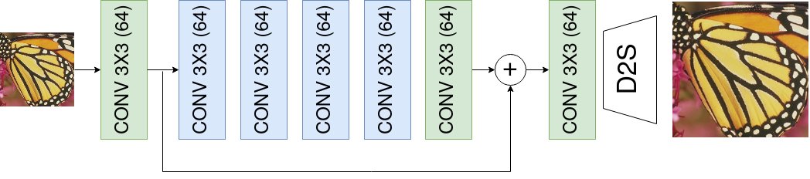
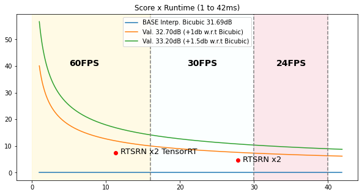

# [NTIRE Real-Time Super-Resolution](https://cvlai.net/ntire/2023/) @ CVPR 2023


**[Marcos V. Conde](https://scholar.google.com/citations?user=NtB1kjYAAAAJ&hl=en), [Eduard Zamfir](https://scholar.google.com/citations?hl=en&user=5-FIWKoAAAAJ), [Radu Timofte](https://scholar.google.com/citations?user=u3MwH5kAAAAJ&hl=en)**


[Computer Vision Lab, CAIDAS, University of Würzburg](https://www.informatik.uni-wuerzburg.de/computervision/home/)


----

## About the Challenge
The [8th edition of NTIRE: New Trends in Image Restoration and Enhancement](https://cvlai.net/ntire/2023/) workshop will be held on June 18th, 2023 in conjunction with CVPR 2023. Top solutions will be presented at the NTIRE Workshop, and will appear in the conference proceedings.

Image Super-Resolution is one of the most popular computer vision problems due to its real-world applications: photography, gaming, generative AI, etc. The goal of the **NTIRE 2023 Real-Time Super-Resolution Challenge** is to **upscale images in real-time** at 30-60FPS using deep learning models and commercial GPUs (RTX 3060, 3090). 
The input images can be large patches or full-resolution images, compressed using JPEG q=90. The challenge has two tracks:

**Track 1**: Upscaling from FHD 1080p to 4K resolution (X2 factor) | [CodaLab Server](https://codalab.lisn.upsaclay.fr/competitions/10227)

**Track 2**: Upscaling from HD 720p to 4K resolution (X3 factor) | [CodaLab Server](https://codalab.lisn.upsaclay.fr/competitions/10228)

The submitted methods will be tested to ensure they satisfy real-time processing on RTX RTX 3090 (24Gb), and will be ranked based on the fidelity (PSNR, SSIM) of their results w.r.t. the high-resolution reference images in our internal test set.

**IMPORTANT**

* Participants can train the models using **any** publicly available open-sourced dataset. Although, complete details must be provided in the report.
* The validation/test dataset consists on a brand-new dataset that includes diverse high-quality filtered content from: **digital art**, **videogames**, **photographies** - Please consider this variety when training your models.

See also the [NTIRE 2023 Efficient Super-Resolution Challenge](https://codalab.lisn.upsaclay.fr/competitions/10256#learn_the_details).

----


## **Performance of baseline methods**

We use the script `test.py` to measure the runtime performance of the baseline models. We use GPU warm-up and average the runtime over `n=244` repetitions. Results are listed below. This baseline method is based on the work presented at [Mobile AI & AIM 2022 Challenge: Efficient and Accurate Quantized Image Super-Resolution on Mobile NPUs](https://arxiv.org/pdf/2211.05910.pdf).

| Method                                                                                    | GPU            | Runtime  | Resolution       | FP32     | **FP16**   | TensorRT FP16 | 
|-------------------------------------------------------------------------------------------|----------------|----------|------------------|----------|------------|---------------|
|[**RTSRN**](https://github.com/eduardzamfir/NTIRE23-RTSR/blob/master/demo/models/rtsrn.py) | RTX 3090 24 Gb | in ms    | 1080p -> 4K (x2) | 49.14    | **29.93**  |    10.97      |
|                                                                                           |                |          | 720p  -> 4K (x3) | 21.84    | **13.28**  |    5.32       |  

> **NOTE:** The scoring is done based on the FP16 performance **without** TensorRT. We specify the versions used of TensorRT below, in case you want to run your method with TensorRT. You can find an example [here](https://github.com/pytorch/TensorRT/blob/main/notebooks/EfficientNet-example.ipynb).
```
tensorrt=8.5.3.1
torch-tensorrt=1.3.0
```



<br>

##  **Prepare Test Dataset**

We degrade the high-resolution images with bicubic downsampling and JPEG compression. You can generate the low-resolution counterparts using following command.

````
python demo/data/prepare_data.py --image-dir [IMAGE-ROOT] --lr-out-dir [LR-OUT-ROOT] --gt-out-dir [GT-OUT-DIR] --downsample-factor [2|3] --jpeg-level 90
````

<br>

## **Evaluation of your submission**

We request that you submit a ```submission_{submission-id}.zip``` file, which should include the following components:

```
submission_{submission-id}.zip/
|--- arch.py
|--- utils/
|    |--- modules.py
|    |--- config.yaml
|    ...
|--- checkpoint.pth
|--- results/
|    |--- 1.png
|    |--- 2.png
|    ...
|--- requirements.txt
```

* ```arch.py```: This file contains your network architecture. Additionally, we request a simple ```srmodel()``` method which returns an instance of your method initialized from your submitted ```checkpoint.pth``` file. In case you are submitting multiple checkpoints, we select a single file randomly. 
* ```utils/```: You may have an additional directory ```utils/``` containing necessary scripts and files to run your model. Please be aware that we expect ```srmodel()``` to return your method with correct configuration, checkpoint etc. **without** input arguments.
* ```results/```: This directory contains your SR outputs saved as ```.png``` files. We calculate PSNR/SSIM metrics using your provided super-resolved images and compare to our internal evaluation of your method using our testing code.
* ```requirements.txt```: Please provide an ```requirements.txt``` file in case you use additional libraries besides the ones described in **our** ```requirements.txt``` file.
* We added in ```demo/``` a ```submission_test.zip``` as example.


### Evalutation procedure

We compute our metrics using ```calc_metrics.py``` and the SR outputs you provide in ```results/```. Please ensure that you adhere to our naming conventions. We report average PSNR/SSIM on RGB and Y-Channel.
```
python demo/calc_metrics.py --submission-id [YOUR-SUBMISSION-ID] --sr-dir ./results --gt-dir [PATH-TO-OUR-GT]
```
Next, we use ```sr_demo.py``` to compute the super-resolved outputs of your submitted method. The SR images will be saved to ```internal/```.
```
python demo/sr_demo.py --submission-id [YOUR-SUBMISSION-ID] --checkpoint [PATH-TO-YOUR-CHECKPOINT] --scale [2|3] --lr-dir [PATH-TO-OUR-LR] --save-sr
``` 
We compute the average runtime of your model per image and report FLOPs with ```demo/runtime_demo.py``` using ```FP32``` and ```FP16```.
```
python demo/runtime_demo.py --submission-id [YOUR-SUBMISSION-ID] --model-name [YOUR-MODEL-NAME]
```

### **Scoring Functions**

The scoring function can be consulted in [calc_scoring.ipynb](demo/calc_scoring.ipynb). Here we show a plot of `Score x Runtime (1 to 42ms)`. [RTSRN](https://github.com/eduardzamfir/NTIRE23-RTSR/blob/master/demo/models/rtsrn.py) is the baseline proposed above. Methods below Bicubic performance are nullified `score=0`.





### **Other Baselines**

We also report the runtime performance of other methods presented at [NTIRE 2022 Efficient Super-Resolution Challenge](https://openaccess.thecvf.com/content/CVPR2022W/NTIRE/papers/Li_NTIRE_2022_Challenge_on_Efficient_Super-Resolution_Methods_and_Results_CVPRW_2022_paper.pdf).


| Method                                       | GPU            | Runtime  | Resolution | FP32     | FP16     | 
|----------------------------------------------|----------------|----------|------------|----------|----------|
|[**IMDN**](https://github.com/ofsoundof/IMDN) | RTX 3090 24 Gb | in ms    | X2 -> 2K   | 73.29    | 47.27    |
|                                              |                |          | X2 -> 4K   | 273.47   | 170.10   |     
|                                              | RTX 3060 12 Gb | in ms    | X2 -> 2K   | 180.15   | 117.67   |
|                                              |                |          | X2 -> 4K   | 666.61   | 438.31   |      
|[**RFDN**](https://github.com/ofsoundof/IMDN) | RTX 3090 24 Gb | in ms    | X2 -> 2K   | 55.54    | 38.19    |
|                                              |                |          | X2 -> 4K   | 203.63   | 135.99   |      
|                                              | RTX 3060 12 Gb | in ms    | X2 -> 2K   | 137.65   | 94.66    |
|                                              |                |          | X2 -> 4K   | 517.35   | 348.40   |      
                                               

Further, we want to show the PSNR differences between running models using `FP16` and `FP32`. As `IMDN` and `RFDN` methods are designed/trained on `X4` super-resolution, we use [Swin2SR](https://github.com/mv-lab/swin2sr) for that. Note that models are evaluated using `FP16`, this might affect the performance of the models if not trained using `MP`, see below. In case for `IMDN` and `RFDN` we did not experience any artefacts when producing SR outputs with `FP16` (using `X4` SR checkpoints for testing purposes).

| Method                                          | PSNR (RGB) | Resolution | FP32  | FP16  |
|-------------------------------------------------|------------|------------|-------|-------|
|[**Swin2SR**](https://github.com/mv-lab/swin2sr) | in dB      | X2 -> 2K   | 32.38 | 28.05 |


## Contact

- Marcos Conde (marcos.conde@uni-wuerzburg.de)
- Eduard-Sebastian Zamfir (Eduard-Sebastian.Zamfir@uni-wuerzburg.de)

## References

[1] [Mobile AI & AIM 2022 Challenge: Efficient and Accurate Quantized Image Super-Resolution on Mobile NPUs](https://arxiv.org/pdf/2211.05910.pdf)

[2] [NTIRE 2022 Efficient Super-Resolution Challenge](https://openaccess.thecvf.com/content/CVPR2022W/NTIRE/papers/Li_NTIRE_2022_Challenge_on_Efficient_Super-Resolution_Methods_and_Results_CVPRW_2022_paper.pdf)
